[](https://app.netlify.com/sites/elegant-thompson-69b225/deploys)

# KrispyKreme 크리스피크림 도넛 🍩 🍩

크리스피크림 웹페이지 리뉴얼 및 제작

[크리스피크림 웹페이지](https://elegant-thompson-69b225.netlify.app/)

[크리스피크림 서브페이지 - 메뉴](https://elegant-thompson-69b225.netlify.app/kkd_submenu.html)

메인페이지 -


서브페이지 - 


## 뷰포트(Viewport) 렌더링 방식 설정

웹페이지가 화면(Viewport)에 표현되는 방식을 설정한다.<br />
모바일 환경에서 적용 된다.

```html
<meta name="viewport" content="width=device-width, initial-scale=1.0" />
```

- `width=device-width` : 화면의 가로 너비를 각 디바이스(Device)의 가로 너비와 동일하게 적용
- `initial-scale=1.0` : 화면의 초기 화면 배율(확대 정도)을 설정
- `user-scalable=no` : 사용자가 디바이스 화면을 확대(`yes`)/축소(`no`)할 수 있는지 설정
- `maximum-scale=1` : 사용자가 화면을 확대할 수 있는 최댓값
- `minimum-scale=1`: 사용자가 화면을 축소할 수 있는 최솟값

## 오픈 그래프(The Open Graph protocol)

웹페이지가 소셜 미디어(페이스북, 카카오톡 등)로 공유될 때 우선적으로 활용되는 정보를 지정한다.

KakaoTalk -


[더 많은 오픈 그래프 속성 보기](https://ogp.me/)

```html
  <meta property="og:type" content="website" />
  <meta property="og:site_name" content="KrispyKreme" />
  <meta property="og:title" content="KrispyKreme" />
  <meta property="og:description" content="크리스피 크림 도넛 소개 사이트, 도너츠, 커피 제품 종류 및 정보, 매장위치 안내." />
  <meta property="og:image" content="./images/krispykreme_seo.png" />
  <meta property="og:url" content="#" />
```

- `og:type`: 페이지의 유형(E.g, `website`, `video.movie`)
- `og:site_name`: 속한 사이트의 이름
- `og:title`: 페이지의 이름(제목)
- `og:description`: 페이지의 간단한 설명
- `og:image`: 페이지의 대표 이미지 주소(URL)
- `og:url`: 페이지 주소(URL)

## 트위터 카드(Twitter Cards)

웹페이지가 소셜 미디어(트위터)로 공유될 때 우선적으로 활용되는 정보를 지정한다.

[더 많은 트위터 카드 보기](https://developer.twitter.com/en/docs/twitter-for-websites/cards/guides/getting-started)

```html
  <meta property="twitter:card" content="summary" />
  <meta property="twitter:site" content="KrispyKreme" />
  <meta property="twitter:title" content="KrispyKreme" />
  <meta property="twitter:description" content="크리스피 크림 도넛 소개 사이트, 도너츠, 커피 제품 종류 및 정보, 매장위치 안내." />
  <meta property="twitter:image" content="./images/krispykreme_seo.png" />
  <meta property="twitter:url" content="#" />
```

- `twitter:card`: 페이지(카드)의 유형(E.g. `summary`, `player`)
- `twitter:site`: 속한 사이트의 이름
- `twitter:title`: 페이지의 이름(제목)
- `twitter:description`: 페이지의 간단한 설명
- `twitter:image`: 페이지의 대표 이미지 주소(URL)
- `twitter:url`: 페이지 주소(URL)

## Favicon(파비콘, favorites icon)

웹페이지를 나타내는 아이콘, 웹페이지의 로고를 설정한다.<br/>
대부분의 경우 루트 경로에 `favicon.ico` 파일을 위치하면 자동으로 로딩하기 때문에 `<link />`를 작성할 필요가 없다. `favicon.png` 파일을 사용하려면 다음과 같이 `<link />`를 작성해야한다.

> 파비콘 이미지는 루트 경로에 있어야 한다
```html
<!--<link rel="shortcut icon" href="favicon.ico" />-->
<link rel="icon" href="./favicon.png" />
```
- `favicon.ico` 64 x 64 (px) 또는 32 x 32 또는 16 x 16
- `favicon.png` 500 x 500 (px)

<br />


### .ico 파일 제작

이미지를 업로드하면 손쉽게 `.ico` 파일을 제작할 수 있다.

[iconifier.net](https://iconifier.net/)

## Reset.css

각 브라우저의 기본 스타일을 초기화 할 수 있는 css 파일 링크

```html
<link rel="stylesheet" href="https://cdn.jsdelivr.net/npm/reset-css@5.0.1/reset.min.css" />
```

## Tabbar 구현

서브페이지 메뉴 탭바 구현


```html
<script>
  $(function(){
    $("#tabbar > #tabbar_wrap > .label > ul > li").click(function(){
      var index=$(this).index();
      $("#tabbar > #tabbar_wrap > .label > ul > li").removeClass("active");
      $("#tabbar > #tabbar_wrap > .description > div").removeClass("active");
      $("#tabbar > #tabbar_wrap > .label > ul > li").eq(index).addClass("active");
      $("#tabbar > #tabbar_wrap > .description > div").eq(index).addClass("active");
    });
  });
</script>
```

```html
<div id="tabbar">
  <h1><span>|</span>Doughnuts</h1>
  <div id="tabbar_wrap">
    <div class="label">
      <ul>
        <li class="active">ALL</li>
        <li>GLAZED</li>
        <li>SEASON</li>
        <li>CLASSIC</li>
        <li>PREMIUM</li>
      </ul>
    </div>
    <div class="description">
      <div class="active">
        <ul>
          <li><a href="javascript:void(0)">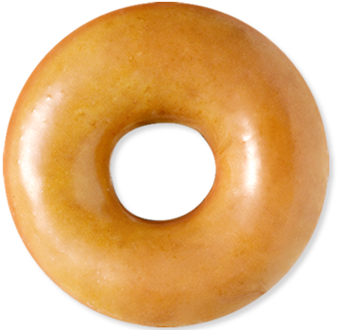
            <div>
              <h1>오리지널 글레이즈드</h1>
              <h2>ORIGINAL GLAZED</h2>
            </div>
          </a></li>
          <li><a href="javascript:void(0)">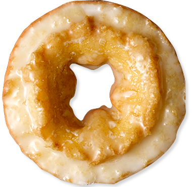
            <div>
              <h1>글레이즈드 사워 크림</h1>
              <h2>GLAZED SOUR CREAM</h2>
            </div>
          </a></li>
          <li><a href="javascript:void(0)">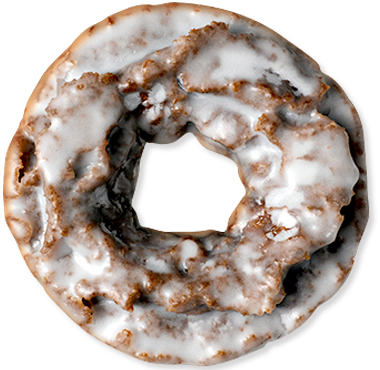
            <div>
              <h1>글레이즈드 초콜릿 케익</h1>
              <h2>GLAZED CHOCOLATE CAKE</h2>
            </div>
          </a></li>
          <li><a href="javascript:void(0)">
            <div>
              <h1>스마일 도넛</h1>
              <h2>SMILE DOUGHNUT</h2>
            </div>
          </a></li>
          <li><a href="javascript:void(0)">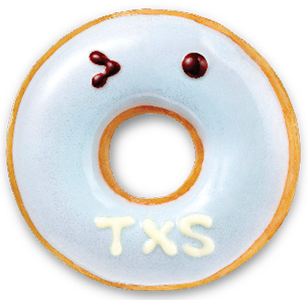
            <div>
              <h1>땡스 도넛</h1>
              <h2>THANKS DOUGHNUT</h2>
            </div>
          </a></li>
          <li><a href="javascript:void(0)">
            <div>
              <h1>러브 도넛</h1>
              <h2>LOVE DOUGHNUT</h2>
            </div>
          </a></li>
          <li><a href="javascript:void(0)">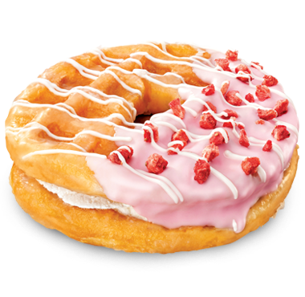
            <div>
              <h1>딸기와플넛</h1>
              <h2>STRAWBERRY WAFFLENUT</h2>
            </div>
          </a></li>
          <li><a href="javascript:void(0)">
            <div>
              <h1>초코와플넛</h1>
              <h2>CHOCO WAFFLENUT</h2>
            </div>
          </a></li>
          <li><a href="javascript:void(0)">
            <div>
              <h1>카라멜와플넛</h1>
              <h2>CARAMEL WAFFLENUT</h2>
            </div>
          </a></li>
          <li><a href="javascript:void(0)">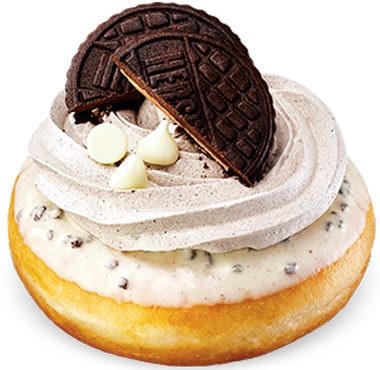
            <div>
              <h1>요! 쿠키</h1>
              <h2>YO! COOKIE</h2>
            </div>
          </a></li>
          <li><a href="javascript:void(0)">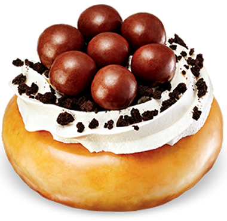
            <div>
              <h1>드롭 더 쿠키</h1>
              <h2>DROP THE COOKIE</h2>
            </div>
          </a></li>
          <li><a href="javascript:void(0)">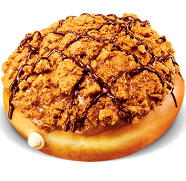
            <div>
              <h1>로투스 비스코프 도넛</h1>
              <h2>LOTUS BISCOFF DOUGHNUT</h2>
            </div>
          </a></li>
          <li><a href="javascript:void(0)">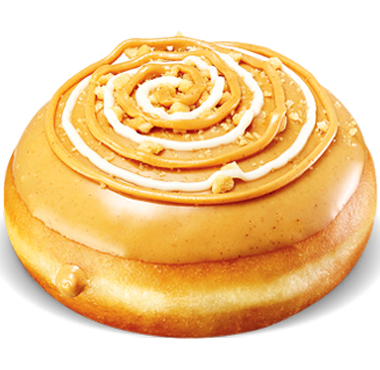
            <div>
              <h1>리고 피넛버터 도넛</h1>
              <h2>PEANUT BUTTER</h2>
            </div>
          </a></li>
          <li><a href="javascript:void(0)">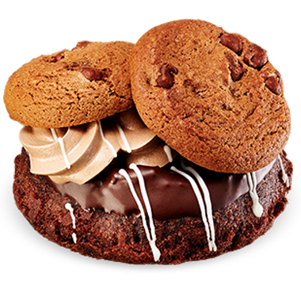
            <div>
              <h1>쿠키 스웩</h1>
              <h2>COOIKE SWAG</h2>
            </div>
          </a></li>
          <li><a href="javascript:void(0)">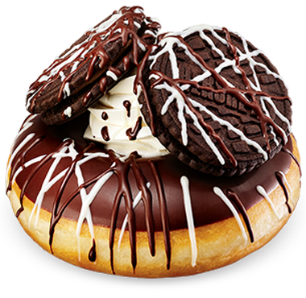
            <div>
              <h1>왓츠 업 더블</h1>
              <h2>WHAT'S UP DOUBLE</h2>
            </div>
          </a></li>
          <li><a href="javascript:void(0)">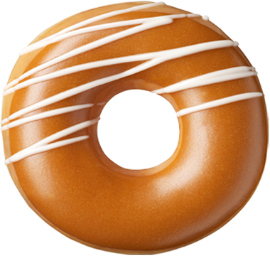
            <div>
              <h1>카라멜 아이스드</h1>
              <h2>Caramel Iced</h2>
            </div>
          </a></li>
          <li><a href="javascript:void(0)">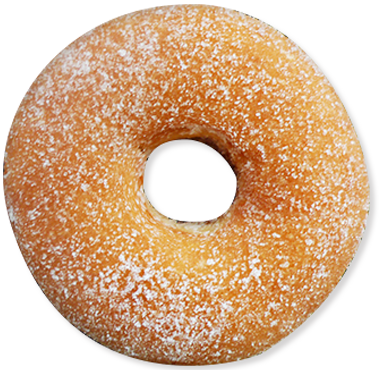
            <div>
              <h1>슈거 코티드</h1>
              <h2>SUGAR</h2>
            </div>
          </a></li>
          <li><a href="javascript:void(0)">
            <div>
              <h1>파우더 스트로베리 필드</h1>
              <h2>POWDERED STRAWBERRY</h2>
            </div>
          </a></li>
          <li><a href="javascript:void(0)">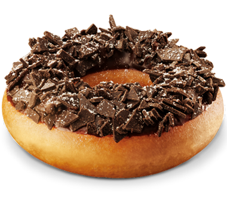
            <div>
              <h1>초코홀릭</h1>
              <h2>CHOCOHOLIC</h2>
            </div>
          </a></li>
          <li><a href="javascript:void(0)">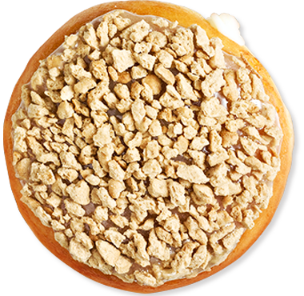
            <div>
              <h1>뉴욕 치즈케익</h1>
              <h2>NEWYORK CHEESECAKE</h2>
            </div>
          </a></li>
          <li><a href="javascript:void(0)">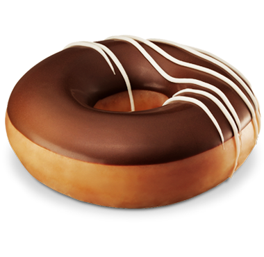
            <div>
              <h1>초콜릿 아이스드 글레이즈드</h1>
              <h2>CHOCOLATE ICED GLAZED</h2>
            </div>
          </a></li>
        </ul>
      </div>

      <div>
        <ul>
          <li><a href="javascript:void(0)">
            <div>
              <h1>오리지널 글레이즈드</h1>
              <h2>ORIGINAL GLAZED</h2>
            </div>
          </a></li>
          <li><a href="javascript:void(0)">
            <div>
              <h1>글레이즈드 사워 크림</h1>
              <h2>GLAZED SOUR CREAM</h2>
            </div>
          </a></li>
          <li><a href="javascript:void(0)">
            <div>
              <h1>글레이즈드 초콜릿 케익</h1>
              <h2>GLAZED CHOCOLATE CAKE</h2>
            </div>
          </a></li>
        </ul>
      </div>
      <div>
        <ul>
          <li><a href="javascript:void(0)">
            <div>
              <h1>스마일 도넛</h1>
              <h2>SMILE DOUGHNUT</h2>
            </div>
          </a></li>
          <li><a href="javascript:void(0)">
            <div>
              <h1>땡스 도넛</h1>
              <h2>THANKS DOUGHNUT</h2>
            </div>
          </a></li>
          <li><a href="javascript:void(0)">
            <div>
              <h1>러브 도넛</h1>
              <h2>LOVE DOUGHNUT</h2>
            </div>
          </a></li>
          <li><a href="javascript:void(0)">
            <div>
              <h1>딸기와플넛</h1>
              <h2>STRAWBERRY WAFFLENUT</h2>
            </div>
          </a></li>
          <li><a href="javascript:void(0)">
            <div>
              <h1>초코와플넛</h1>
              <h2>CHOCO WAFFLENUT</h2>
            </div>
          </a></li>
          <li><a href="javascript:void(0)">
            <div>
              <h1>카라멜와플넛</h1>
              <h2>CARAMEL WAFFLENUT</h2>
            </div>
          </a></li>
        </ul>
      </div>
      <div>
        <ul>
          <li><a href="javascript:void(0)">
            <div>
              <h1>초코홀릭</h1>
              <h2>CHOCOHOLIC</h2>
            </div>
          </a></li>
          <li><a href="javascript:void(0)">
            <div>
              <h1>뉴욕 치즈케익</h1>
              <h2>NEWYORK CHEESECAKE</h2>
            </div>
          </a></li>
          <li><a href="javascript:void(0)">
            <div>
              <h1>초콜릿 아이스드 글레이즈드</h1>
              <h2>CHOCOLATE ICED GLAZED</h2>
            </div>
          </a></li>
          <li><a href="javascript:void(0)">
            <div>
              <h1>카라멜 아이스드</h1>
              <h2>Caramel Iced</h2>
            </div>
          </a></li>
          <li><a href="javascript:void(0)">
            <div>
              <h1>슈거 코티드</h1>
              <h2>SUGAR</h2>
            </div>
          </a></li>
          <li><a href="javascript:void(0)">
            <div>
              <h1>파우더 스트로베리 필드</h1>
              <h2>POWDERED STRAWBERRY</h2>
            </div>
          </a></li>
        </ul>
      </div>
      <div>
        <ul>
          <li><a href="javascript:void(0)">
            <div>
              <h1>요! 쿠키</h1>
              <h2>YO! COOKIE</h2>
            </div>
          </a></li>
          <li><a href="javascript:void(0)">
            <div>
              <h1>드롭 더 쿠키</h1>
              <h2>DROP THE COOKIE</h2>
            </div>
          </a></li>
          <li><a href="javascript:void(0)">
            <div>
              <h1>로투스 비스코프 도넛</h1>
              <h2>LOTUS BISCOFF DOUGHNUT</h2>
            </div>
          </a></li>
          <li><a href="javascript:void(0)">
            <div>
              <h1>리고 피넛버터 도넛</h1>
              <h2>PEANUT BUTTER</h2>
            </div>
          </a></li>
          <li><a href="javascript:void(0)">
            <div>
              <h1>쿠키 스웩</h1>
              <h2>COOIKE SWAG</h2>
            </div>
          </a></li>
          <li><a href="javascript:void(0)">
            <div>
              <h1>왓츠 업 더블</h1>
              <h2>WHAT'S UP DOUBLE</h2>
            </div>
          </a></li>
        </ul>
      </div>
    </div>
  </div>
</div>
```